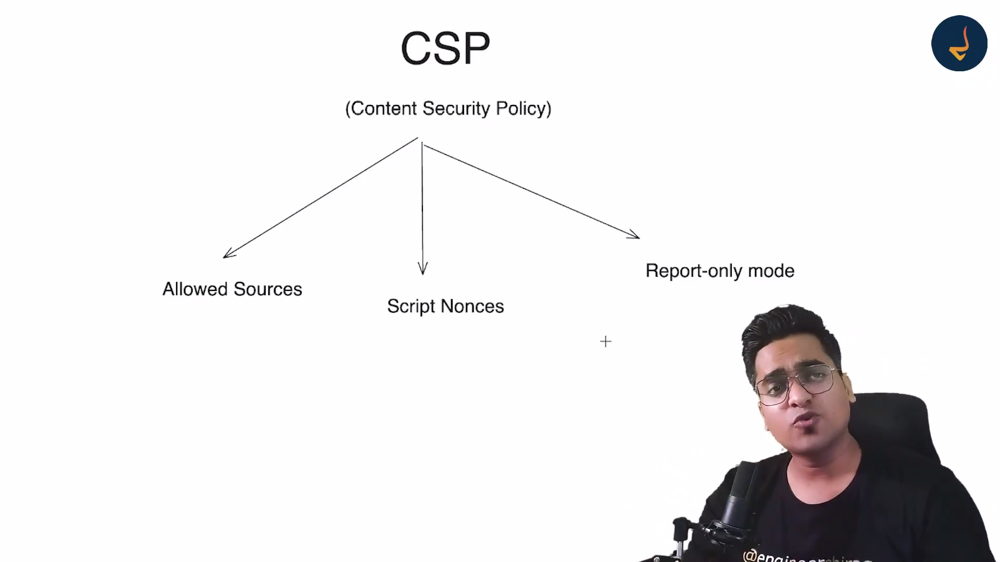

# REST API Overview

## Architecture

### 1st Tier

### 2nd Tier

### 3rd Tier

## What is an API?

An **API** (Application Programming Interface) is an interface that facilitates communication between two programming services or languages. It enables data exchange and interaction across software.

## What is a REST API?

**REST API** (Representational State Transfer Application Programming Interface) dictates how data should be represented and transferred between two services, such as between a client and a server or between services and a database.

## What is HTTP?

**HTTP** (HyperText Transfer Protocol) is a standard that helps in the communication of data across web services by defining how data is to be exchanged.

## Benefits of REST API

## Building Blocks

## Request

## Response

## URL Parts

In this URL, at the end, there is a fragment that is client-side only and not sent to the server. This means it does not affect server-side behavior or requests. It is typically used to refer to a specific section within a webpage, such as a heading, an anchor, or an element with a particular ID.

### Example: TODO Application

## Headers

### Request Headers

### Response Headers

## Status Codes

# GraphQl

## Overview

## How it works

- On a single query itself we can all the datas do not require to have multiple queries

## Benfits

## Rest Vs GraphQl

## Fundamentals

## GraphQl Building Blocks

### We implement GraphQl check GraphQl folder for more details

# gRPC

gRPC - Google Remote Procedure Call

## OverView

## gRPC

## Protocol Buffer

## Architecture of gRPC

### We created gRPC app refer the gRPC folder

## Diff between REST and gRPC

## Advantages And Disadvantages

# Communicating Technique

## Popular Interview Question

## OverView

### Short Polling

- Consitently asking the data is ready after completing give the data(Eg: Payment Transaction is sucessful)

### Long Polling

- After completing the entire data only the data will be given to the user

### Websocket

- Do not need to wait for the data to recieve you can add more requests to the server and keep repeating it ,a two way connection

### SSE (Server Sent Event)

- Some events without your involvement actually go through but you got the data

### Webhooks

- Predefined events at a particular events have completed

## Short Polling

- Frequently check for new notification by passing request in every 5 seconds

- Refer the Short Polling Folder and we created an example for it

## Long Polling

- The request will be live on the server until a new update is available from the server

- Refer the folder Long Polling in the communication Techniques

## Websocket

- Refer the folder WebSocket in the communication techniques
- Created a chat bot

## Server Side Events

- Refer the folder Server sent Events in the communication techniques

## Web Hooks

- Refer the folder WebHooks in the communication techniques

# Secuirty

### OverView

### What is Covered

### Popular Interview Question

## Secuirty Overview

## XSS (Cross site Scripting)

- Here we will discuss the vulnerabilities attack and mitigation for it

- Created two html files named example and example1 check on security > XSS > vulnerabilities folder

- Example 1 : Simply pass the query params for the user name

- Example 2 :User session hijacking , Pass the query params for the the user name but containing some vulnerability in it

  
  

- Example 3 : Unathorized activities , Pass the query params for the vulanerabilty and create a post
  
  

- Example 4 : Capturing Keystrokes , it will monitor all the keys pressed
  
  
  

- Example 5 : Stealing Critical information,
  
  
  

- Example 5 : Phising the website
  
    
  

- Mitigation to avoid the vulnerability  
  

  - Avoid Using eval

  - CSP (Content Security Policy) Headers
    
  - Check the mitigation folder

## IFRAME PROTECTION

### Clickhijacking

- Refer the folder security/iframe-protection

### Data Thefting

### Mitigation

## Secuirty Headers 

### X-Powered-By

### Referrer- Policy

- Its like leaking the url from move to one url to another url so we should handle it

### X-Content-Type-Options

- So there is a chance when client send image to server and inbetween the file have changed into something
html or js it should be avoided

### X-XSS-Protection
- If we have done the proper CSP it can be avoided

### HSTS (Strict Transport Security)
- 

## Client Side Storage 

### Session Management 

- Here it set HttpOnly so it can not fetch through js code only through the http server

- Storing data on the browser should be thinked twice

## Secure Communication HTTPS

## Dependency Security

- To make the auditing easier we can dependabot.yml 

## Compliance and Regulations

## Input Validation and Sanitization

## SSRF 

### Problems created by 

## Server Side Javascript Injection

### Solution for it

## Feature policy and permission policy 

## SRI (Sub Resource Integrity)

- Check and learn the permission policy from wesite 'https://permissions-policy-demo-glitch.me'

#THE END BEII
